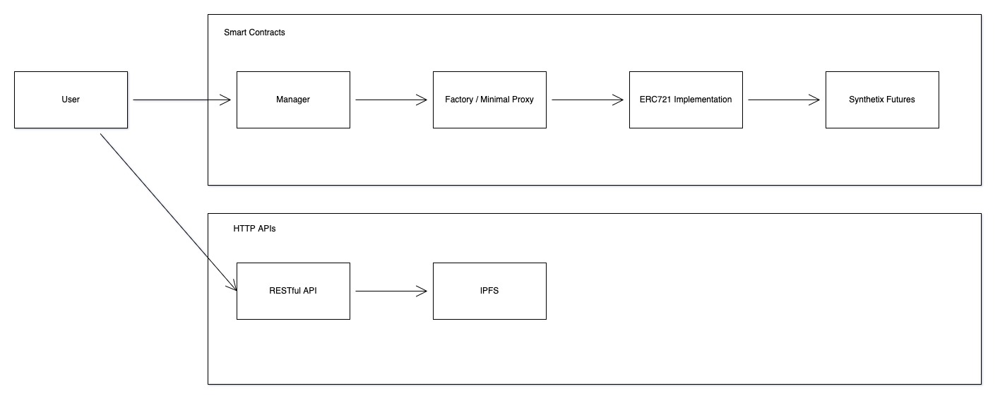
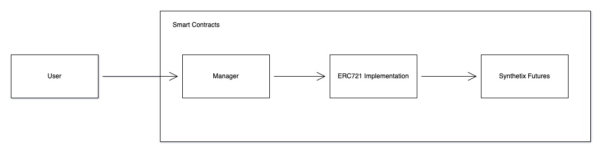

# pozition

**Welcome to Pozition (Position but with a 'z')!**

The idea and project was developed during [ETH NY](https://ethglobal.com/showcase/pozitions-c53qd). The original code can be found [here](https://github.com/fritzschoff/notSynthetix). This project is an extension of the idea with the intent to build a production-ready dApp. **THIS IS CURRENTLY WORK IN PROGRESS (WIP).**

Pozition aims to provide a mechanism to allow future positions on Synthetix to be transferrable. As of current, positions are tracked and managed directly by Synthetix. If you wanted to move a position from one wallet to another, you first have to close the position, withdraw your margin, and transfer sUSD to another wallet. This is quite tedious and may incur tax obligations/losses.

Using `pozition`, a 1/1 NFT is minted on every position, effectively giving the user a receipt to represent their position for each market they're participating in. This allows users to move positions freely without the hassle of closing a position and moving margin.

Interestingly, allowing users to trade positions in a decentralised manner opens the space to further derivatives. I'll leave that thought to the inclined reader.

## Development

```bash
# Clone the project for development.
git clone git@github.com:davidvuong/pozition.git
```

```bash
# Install all dependencies
yarn
```

```bash
# Compile the SC package for development (typechain etc.)
yarn workspace @pozition/core compile
```

```bash
# Start a local node
yarn hardhat node
```

```bash
# Deploy SCs on your localhost (make sure local node is available)
npx hardhat run --network localhost scripts/deploy.ts
npx hardhat run --network optimism-kovan scripts/deploy.ts
```

## Testing

This project follows the prescribed assertion and testrunner, `chai` and `mocha` respectively. To execute tests:

```bash
yarn workspace @pozition/core test
yarn workspace @pozition/core test:coverage
```

## Manual Interaction

```bash
# Drops you into a node repl with `ethers` available
#
# @see: https://docs.ethers.io/v5/
npx hardhat run --network optimism-kovan scripts/deploy.ts
```

```ts
const Factory = await ethers.getContractFactory('FuturesPositionsManager');
const Contract = await Factory.attach('0x...');
const tx = await Contract.depositsUSD(1, { gasLimit: 5_000_0000 });
```

Before you can do that, head over to [Paradigm](https://faucet.paradigm.xyz/) to drip ETH and DAI to your wallet. After, navigate to [Synthetix>Loans](https://staking.synthetix.io/) to borrow sUSD against your ETH. Now you have sUSD to experiment with.

## Etherscan Verification

To try out Etherscan verification, you first need to deploy a contract to an Ethereum network that's supported by Etherscan, such as Ropsten.

In this project, copy the `.env.example` file to a file named `.env`, and then edit it to fill in the details. Enter your Etherscan API key, your Optimism Kovan node URL (eg from Alchemy), and the private key of the account which will send the deployment transaction. With a valid `.env` file in place, first deploy your contract:

```bash
hardhat run --network optimism-kovan scripts/deploy.ts
```

Then, copy the deployment address and paste it in to replace `DEPLOYED_CONTRACT_ADDRESS` in this command:

```bash
npx hardhat verify --network optimism-kovan DEPLOYED_CONTRACT_ADDRESS <constructor arg 1> <constructor arg 2...>
```

_This project uses Optimism so API keys must be created in https://optimistic.etherscan.io/_

## Architecture

Below is a high level overview of Pozition v1:



The primary deviation is the user interaction with Synthetix futures markets. Rather than directly invoking methods like `modifyPosition`, giving position ownerships to the user `msg.sender`, Pozition mints and manages interactions via NFTs.

An example workflow may look like:

1. User calls `deposit` on `Manager` to deposit `sUSD` as margin to open a position
1. User calls `openPosition` on `Manager`, specifying the market and size of their position
1. Manager invokes the `ERC721` factory to clone an existing implementation, immediately withdrawing the specified `sUSD` margin to the newly minted NFT
1. The NFT henceforth interacts with Synthetix futures, operating as a user normally would, had they traded on platforms such as Kwenta
1. After a position is created, ownership will associated to the NFT. The NFT is transferred to the user

_Assuming post `deposit`, all of this happens in a single transaction._

Pozition also provides helper methods to perform a deposit and trade in the same operation. Note that the inverse occurs when a position is closed and `sUSD` is deposited back to the `Manager` for withdrawl.

You may notice that this also includes a RESTful API to communicate with IPFS, invoked by the same user calling the Manager. The original project provided rich visual representation of future positions. SVG permutations (long/short, size, market) were generated off-chain and used as templates to generate new NFTs, feeding data about the position about to be opened.

Pozition v2 is much simpler:



Steps are largely the same. However, `Manager` and `Factory` has been merged and the need for a HTTP RESTful API and IPFS is no longer necessary.

---

_Below is autogenerated documentation from hardhat - keeping the below around for now._

# Advanced Sample Hardhat Project

This project demonstrates an advanced Hardhat use case, integrating other tools commonly used alongside Hardhat in the ecosystem.

The project comes with a sample contract, a test for that contract, a sample script that deploys that contract, and an example of a task implementation, which simply lists the available accounts. It also comes with a variety of other tools, preconfigured to work with the project code.

Try running some of the following tasks:

```shell
npx hardhat accounts
npx hardhat compile
npx hardhat clean
npx hardhat test
npx hardhat node
REPORT_GAS=true npx hardhat test
TS_NODE_FILES=true npx ts-node scripts/deploy.ts
```

# Performance Optimizations

For faster runs of your tests and scripts, consider skipping ts-node's type checking by setting the environment variable `TS_NODE_TRANSPILE_ONLY` to `1` in hardhat's environment. For more details see [the documentation](https://hardhat.org/guides/typescript.html#performance-optimizations).
